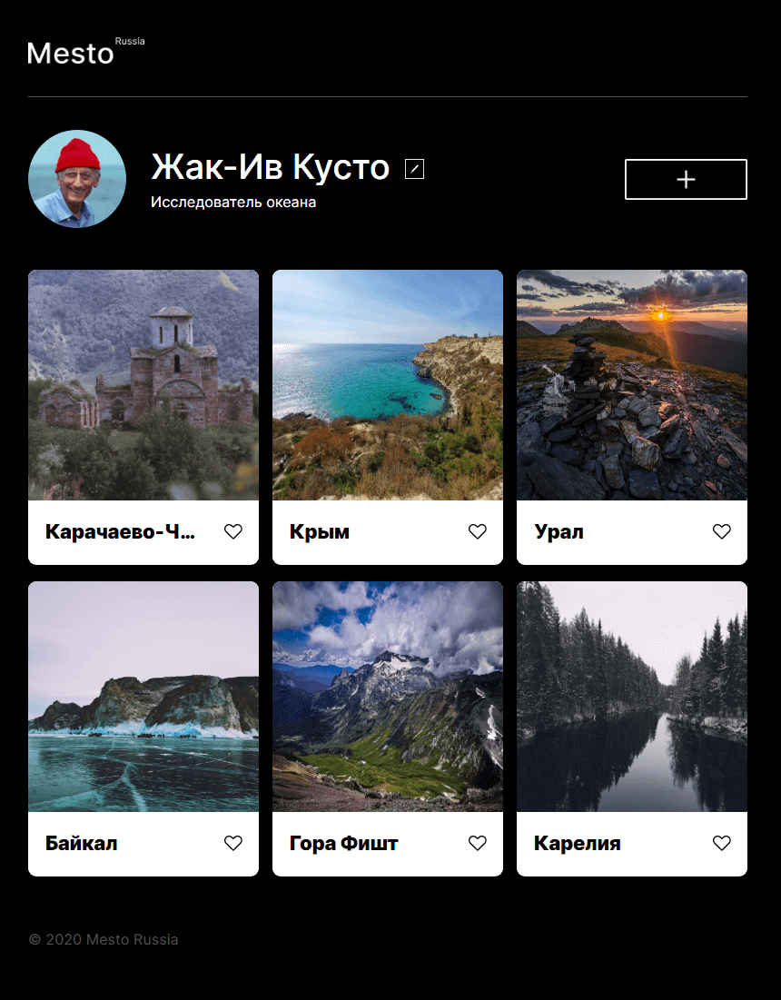

# Mesto. Russia
   

https://marvish.github.io/mesto/index.html
------
Узкоспециализированный "инстаграм" для красивых мест России. Сайт содержит шапку с логотипом,  блок с информацией о профиле с возможностью редактирования, блок с фото и подвал.

## Используемые технологии
**HTML5** — Разметка сайта выполнена с использованием [последнего стандарта w3.org](https://www.w3.org/standards/webdesign/htmlcss)

**CSS3** — Технология для описания стилей элементов.
В макете используются CSS Flexbox и CSS Grid Layout:
  * CSS Flexbox — это технология для создания сложных гибких макетов за счёт правильного размещения элементов на странице;
  * CSS Grid Layout представляет двумерную сетку для CSS. Grid можно использовать для размещения основных областей страницы или небольших элементов пользовательского интерфейса.

**JavaScript** — мультипарадигменный язык программирования, который позволяет создать динамически обновляемый контент, управляет мультимедиа, анимирует изображения и многое другое.

**БЭМ** — [Методология для разработки сайтов](https://bem.info/methodology/) созданная в Яндексе. Она позволяет создавать расширяемые и повторно используемые компоненты интерфейса.
